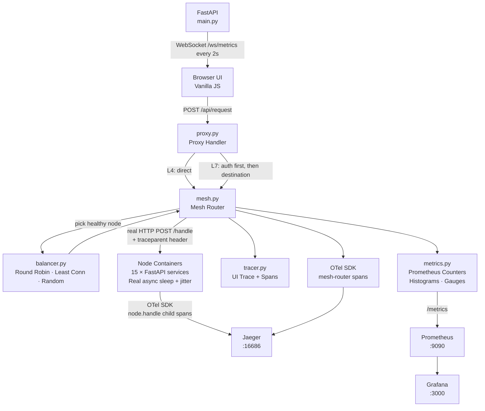

# Mesh Simulator

A small-scale service mesh running 15 containerized nodes across 5 services, with distributed tracing via OpenTelemetry → Jaeger and Prometheus → Grafana observability. Implements L4/L7 proxy modes, three load balancing algorithms, live node health toggling, and chaos fault injection — all wired to a real-time browser UI.

**The interesting parts:** real cross-process distributed tracing with W3C `traceparent` context propagation across container boundaries, async HTTP routing with a shared connection pool, and a deliberate distinction between operator-driven failover events and transient HTTP failures in the metric design.

**Built with:** Python · FastAPI · Docker · OpenTelemetry · Jaeger · Prometheus · Grafana · WebSockets · Vanilla JS

---

## Architecture

Each of the 15 nodes is a real Docker container running an independent FastAPI service. The mesh router makes real HTTP calls across the Docker network. When a node is killed or toggled down, the load balancer detects the failure on the next request and routes around it. Distributed traces are propagated via W3C `traceparent` headers and exported to Jaeger, where you can follow a request from the mesh router through to the specific node container that handled it.

### Request Flow



### Simulated Topology

```
rides      → [rides-1,         rides-2,         rides-3        ]
payments   → [payments-1,      payments-2,      payments-3     ]
maps       → [maps-1,          maps-2,          maps-3         ]
auth       → [auth-1,          auth-2,          auth-3         ]
notifications → [notifications-1, notifications-2, notifications-3]
```

Each node has a fixed `base_latency_ms` assigned at build time (10–150ms range). Real latency = `base_latency + jitter(-5ms to +20ms)` per request, simulated via `asyncio.sleep` so node containers handle concurrent requests without blocking.

---

## Features

- **Real containerized nodes** — each node is a live Docker container; the load balancer makes actual HTTP calls across the Docker network. Latency is real network + simulated sleep, not an in-memory dictionary lookup.
- **L4 and L7 Proxy Modes** — L4 routes source → destination directly. L7 routes source → auth → destination; auth failure short-circuits without hitting the destination.
- **Three Load Balancing Algorithms** — Round Robin, Least Connections, Random. Configurable per service at runtime without restart.
- **Live Node Health Toggle** — click any node card to mark it down. Unhealthy nodes are skipped by the load balancer. When a container is killed externally, the router detects the connection failure on the next request and returns an error; health is tracked independently of container state.
- **Distributed Tracing (OpenTelemetry → Jaeger)** — every request generates OTel spans with W3C `traceparent` headers propagated to node containers. Jaeger shows the full parent→child span chain across process boundaries, with `node.id`, `lb.algorithm`, and `proxy.mode` attributes.
- **Prometheus Metrics + Grafana** — five metrics exposed at `/metrics`. Grafana dashboard auto-provisions on startup with six panels: request rate, p95 latency, active connections, node health, error rate, failover events.
- **Burst Mode** — sends 10 sequential requests; useful for observing load balancer distribution and triggering visible traffic in Jaeger and Prometheus.
- **WebSocket Live Updates** — node state broadcast to all connected clients every 2 seconds. Auto-reconnects on disconnect.
- **Configurable Fault Injection** — set `ERROR_RATE` env var per node in `docker-compose.yml` (default 0%). Set `payments-2` to `ERROR_RATE=0.3` to inject a 30% error rate on one node without touching others.

---

## Local Setup

**Prerequisites:** Docker Desktop

```bash
git clone <repo>
cd mesh-simulator
docker compose up --build
```

First build pulls base images and installs packages — takes ~2 minutes. Subsequent starts use cached layers: `docker compose up`.

| Service | URL |
|---|---|
| Mesh Simulator UI | http://localhost:8000 |
| Jaeger Trace UI | http://localhost:16686 |
| Prometheus | http://localhost:9090 |
| Grafana | http://localhost:3000 (admin / admin) |

The Grafana dashboard and Prometheus datasource provision automatically — no manual configuration needed.

---

## Proxy Modes

| Mode | Routing Pattern | Use Case |
|---|---|---|
| L4 | source → destination (direct) | Transport-level routing, no application awareness |
| L7 | source → auth → destination | Application-layer routing; auth failure short-circuits the request |

## Load Balancing Algorithms

| Algorithm | Selection Logic |
|---|---|
| Round Robin | Cycles through healthy nodes via a per-service index counter |
| Least Connections | Picks the healthy node with the lowest `active_connections` count |
| Random | Uniformly random selection from healthy nodes |

All algorithms filter to healthy nodes first. If no healthy nodes exist, the request fails with `no_healthy_nodes`.

## Node Latencies

Fixed at build time. Base latency is the floor; actual latency adds ±jitter per request.

| Node | Base Latency |
|---|---|
| rides-1 | 42ms |
| rides-2 | 87ms |
| rides-3 | 130ms |
| payments-1 | 28ms |
| payments-2 | 95ms |
| payments-3 | 61ms |
| maps-1 | 110ms |
| maps-2 | 19ms |
| maps-3 | 75ms |
| auth-1 | 55ms |
| auth-2 | 140ms |
| auth-3 | 33ms |
| notifications-1 | 88ms |
| notifications-2 | 22ms |
| notifications-3 | 103ms |

---

## Prometheus Metrics

| Metric | Type | Labels | Description |
|---|---|---|---|
| `mesh_requests_total` | Counter | `source`, `destination`, `status` | Total requests by route and outcome |
| `mesh_request_latency_seconds` | Histogram | `destination` | Latency distribution per destination service |
| `mesh_active_connections` | Gauge | `node` | Current active connections per node |
| `mesh_node_health` | Gauge | `node` | 1 = healthy, 0 = down |
| `mesh_failover_total` | Counter | `node` | Increments when a node is explicitly toggled down via the UI |

**Note on `mesh_failover_total`:** This counter increments only on explicit operator health-toggles, not on HTTP failures. A container being killed increments `mesh_requests_total{status="error"}` (transient failure), while a UI health-toggle increments `mesh_failover_total` (intentional operator action). This distinction mirrors how production meshes separate circuit-breaker events from deliberate maintenance actions.

---

## OTel Trace Structure

Every request through the mesh router creates an OTel trace. Example for an L7 request (rides → maps):

```
mesh-router    route.auth         [55ms]   node.id=auth-3, lb.algorithm=round_robin, proxy.mode=l7
  auth-3         node.handle      [55ms]   node.id=auth-3, base_latency_ms=33
mesh-router    route.maps         [131ms]  node.id=maps-1, lb.algorithm=round_robin, proxy.mode=l7
  maps-1         node.handle      [131ms]  node.id=maps-1, base_latency_ms=110
```

Spans are exported via OTLP gRPC to Jaeger at `http://jaeger:4317`. BatchSpanProcessor flushes every ~5 seconds — wait a moment after sending requests before querying Jaeger.

---

## API Reference

| Endpoint | Method | Description |
|---|---|---|
| `/` | GET | Serves the frontend |
| `/api/services` | GET | List of 5 service names |
| `/api/nodes` | GET | All 15 nodes with health, latency, and connection state |
| `/api/request` | POST | Send a request through the mesh |
| `/api/node/health` | POST | Toggle a node's health status |
| `/api/algorithm` | POST | Change the load balancer algorithm for a service |
| `/metrics` | GET | Prometheus metrics (scraped every 5s) |
| `/ws/metrics` | WebSocket | Node state broadcast every 2 seconds |

**POST /api/request**
```json
{ "source": "rides", "destination": "payments", "mode": "l7" }
```
Response:
```json
{
  "trace": {
    "trace_id": "495a6e02",
    "total_ms": 242.49,
    "spans": [
      { "service": "auth",     "node": "proxy", "duration_ms": 167.65, "status": "ok" },
      { "service": "payments", "node": "proxy", "duration_ms": 74.82,  "status": "ok" }
    ]
  },
  "destination_node": {
    "node_id": "payments-3",
    "service": "payments",
    "healthy": true,
    "active_connections": 0,
    "base_latency_ms": 61
  },
  "error": null,
  "mode": "l7"
}
```

**POST /api/node/health**
```json
{ "node_id": "payments-2", "healthy": false }
```

**POST /api/algorithm**
```json
{ "service": "payments", "algorithm": "least_connections" }
```

---

## Demo Scenarios

### Failure and recovery
```bash
docker compose kill rides-2
# Send burst requests to rides — load balancer routes around the dead node
docker compose start rides-2
# rides-2 re-enters rotation on the next request
```

### Controlled error rate
Edit `docker-compose.yml`, set `ERROR_RATE=0.3` for `payments-2`, then:
```bash
docker compose up -d payments-2
```
Send requests to payments — ~30% will error. Visible in Jaeger (`error=true` attribute) and Prometheus (`mesh_requests_total{status="error"}`).

### Algorithm comparison
Switch payments to `least_connections` via the UI algorithm panel, then run burst mode. Observe in Grafana that active connections distribute unevenly based on node latency rather than round-robin cycling.

---

## Key Design Decisions

**Why real containers instead of in-memory simulation?**
With in-memory nodes, the load balancer was routing through a Python dict — no network, no concurrency, no real failures. Real containers mean the latency is actual async sleep across a Docker network, connection failures propagate as real exceptions, and killing a container (`docker compose kill`) produces the same error path as a production outage. The distinction matters for observability: Jaeger traces show actual cross-process spans, not synthetic data.

**Why `asyncio.sleep` instead of `time.sleep` in node containers?**
Node containers use `async def` + `await asyncio.sleep()`. A sync `time.sleep` in a FastAPI endpoint blocks the entire worker thread — with 15 nodes and burst requests, this serializes concurrent calls and makes the load balancer appear broken when it's a concurrency model mismatch. Async sleep yields the event loop, so each container handles concurrent requests correctly.

**Why a shared `httpx.AsyncClient` instead of one client per request?**
Creating a new httpx client per request opens a new TCP connection each time. With burst mode (10 requests), this doubles perceived latency. A module-level `AsyncClient` initialized in the FastAPI lifespan maintains a TCP connection pool across requests — the same pattern used in production services.

**Why OTel separate from the existing `Trace`/`Span` classes?**
The existing `Trace`/`Span` classes power the UI span bars — they're synchronous, in-process, and purpose-built for rendering. OTel runs in parallel and exports to Jaeger without touching the UI path. The two systems serve different purposes: one is for the live visual, one is for the distributed trace backend. Merging them would couple the UI rendering to the OTel SDK lifecycle.

**Why is `mesh_failover_total` not incremented on HTTP failures?**
`mesh_failover_total` tracks explicit operator actions — when a human toggles a node down via the UI. An HTTP failure from a dead container is a transient event tracked by `mesh_requests_total{status="error"}`. In production meshes, these map to different alert severities: a health-toggle is a maintenance event (low urgency), while a spike in `status="error"` may be a live incident. Keeping them separate means you can alert on each independently.

**Why serve the frontend from FastAPI instead of a separate server?**
The simulator is a single-page tool, not a product. Serving from the same FastAPI process eliminates CORS configuration, a separate build step, and a second container. The frontend is three files (HTML, CSS, JS) with no bundler.

**Planned Level 4: Go control plane**
The `goplane/` directory contains a Go HTTP server stub. The planned upgrade makes Go the owner of service discovery and routing configuration, with the Python backend pushing config updates to it via gRPC streaming — mirroring the xDS API pattern used by Istio and Envoy (where Istiod pushes config to Envoy proxies). The directory is kept in the repo to preserve this upgrade path; the current implementation routes end-to-end in Python.

---

## Production Gaps

This is a learning and portfolio project. A production service mesh would additionally require:

- **Real sidecar proxies** — replace the Python routing layer with Envoy or Linkerd proxies injected as sidecars into each pod; the mesh router would be the control plane, not the data plane
- **mTLS** — all inter-service communication is unencrypted plain HTTP; production meshes enforce mutual TLS at the sidecar level
- **Circuit breaking** — health is a binary toggle; production meshes implement circuit breakers with half-open states, per-host ejection thresholds, and automatic recovery windows (Envoy's `OutlierDetection`)
- **Retry budgets** — failed requests are not retried; production meshes configure per-route retry policies with budget limits to prevent retry storms
- **Traffic shaping** — no canary, blue-green, or weighted routing; production meshes support percentage-based traffic splits at the routing level
- **Service discovery** — node addresses are hardcoded in `docker-compose.yml`; production meshes use etcd, Consul, or Kubernetes service DNS with health-based registration/deregistration
- **Persistent metrics storage** — Prometheus data is ephemeral; production setups use remote write to Thanos or Cortex for long-term retention
- **Auth on control endpoints** — `/api/node/health` and `/api/algorithm` have no access control; production equivalents are privileged operations
